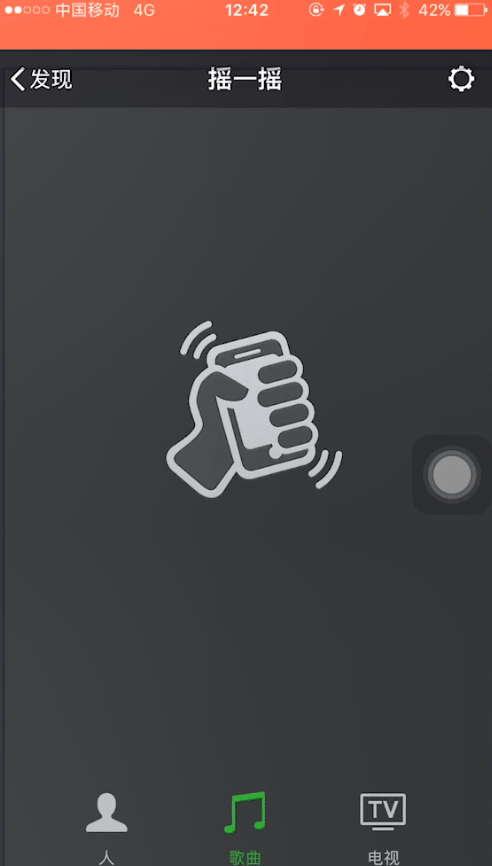
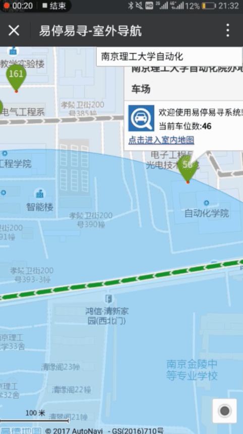
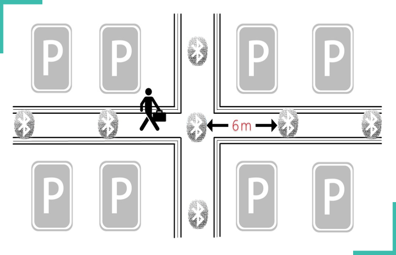
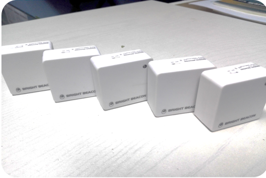

# Underground-Parking-Micro-Navigation-System
Demonstration on my personal work in this project supplemented with an overview of the whole project.

## 1. Brief Overview on the whole project
The project can be broken down into 3 functional modules from the perspect of a user:

### 1.1 Outdoor Navigation module
A relatively minor module responsible for outdoor navigation and parking place distribution display

### 1.2 Indoor Car-parking-and-finding service module 
We set up a website attached to a Wechat public account via which a user can see the digital map of underground parking places with his or her real-time position marked on it. 

The page also provide the service of routine optimization. These 3 functionalities----map rendering, real-time positioning and routine optimization----combined to complete a car-parking-and-finding business. 

(Wechat is a very popular social platform in China)

### 1.3 Parking fee online inquery and settlement
A user can check the parking fee and make a payment online through another website.

## 2. Personal work demostration
I was in charge of the front end deveopment and part of backend development (Wechat API configuration) alone. All pages displayed below are written by myself.

### 2.1 Outdoor Navigation system

An outdoor navigation page is set up using Gaode SKD (Gaode is the Chinese version of Google Map), through which users can :
    
1. Get an overview of the parking place nearby.
    - Number of free parking lots of those places are marked on the map and different colors are applied to those marks to indicate a general number of free lots in a parking place.(Green:more than 100+, Yellow:99-30, Red:less than 30). 
2. Get service of outdoor naviagtion, just like any other commonly seen navigation system.
3. Click on one of those marks to enter the indoor navigation page of the parking place.

__Supplimentary introduction__
1. The state of a parking lot is monitored by carmeras deployed in parking places, and a backend server is set up by my group mates to fulfill the task of collecting data from parking lots. 

### 2.2 Indoor Navigation system
When a user is about to entering an underground parking lots, there are 2 ways that he or she can get into the indoor navigation page:

1. __Using Wechat Shake__

Wechat provides an API that allow beacons to push specific messages to surrounding users, called WeChat shake. A user can get the link of the page pushed by beacons.

2. __Click on the marks in the outdoor navigation page__

#### Indoor Positioning and Routine Optimization demostration
1. __indoor Postioning and Routine Optimization__

2. __Routine Optimization__

Detailed description of my work here :

**Communicating with backend server :** When a user get into the page, I post the numbering of a parking place to server to get all kinds of data I need in the following process.

**Map rendering :** OpenLayers library is used here to render the digital map, including the state of parking lots, the position of a user and the path.

The map is generate by ArcGIS, which my group mate worked on.

**Positioning Algorithm Development :**

    Beacons' Position + RSSI Value ==> Users' Position. 
The page read RSSI of beacons nearby through a Wechat API. 
The position algorithm is developed on my own. The process that I develop the algorithm is that: 

1. First massive raw data of RSSI along with the real distance is collected and a classic positioning model is implimented with parameters carefully tuned .
2. Then a linear piecewise function is used to approximate that model in order to reduce the calculation complexity.

The position calculation is completed at the front end.

**Routine Optimization :**

Dijkstra algorithm is implemented here to get the optimal path from the starting point to the destination.

An adjeacent matrix concatenation algorithm is devised by me to deal with 
cross floor routine optimization problem.
        
- How does an adjeacent matrix associated with a map?
    - In practise aside from map layers like parking lots layer, routine layer there is a special layer called circle layer, where many dots are placed along the asile to form a graph. The adjecent matrix can be generated by ArcGIS using some toolbox. 
    - Every parking lot can be linked to the closest dot using a specific API in OpenLayers. 

The routine optimization task is completed at the frontend as well, instead of the backend.

**WeChat API Configuration :**

I setup a simple backend server to deal with issues of Wechat and storing my frontend files at the initial phase of the project . Those APIs are responsible for Wechat public account, communication between beacons and the web page, and online payment that allows user to settle their parking fee online.

The programming language here is PHP.

**Beacon Configuration and installment :**
The following are how beacons installed and beacons that we used.

### 2.3 Online parking fee inquery and Settlement

__User-friendly Interface Design__
The License plate number in China involves 2 part : Name of province + 5 digits of numbers and letters. The former are characters hard to input since rarely do we use them in daily life. So I designed a user-friendly interface for user to input their license plate number with special keyboard includes all characters for those province and it will automatically switches to a normal keyboard at blocks intended to input the number and the letter.

The buttum on the right is to adjust digits of the plate number for new energy vehicles since they have 6 digits of numbers+letters.
